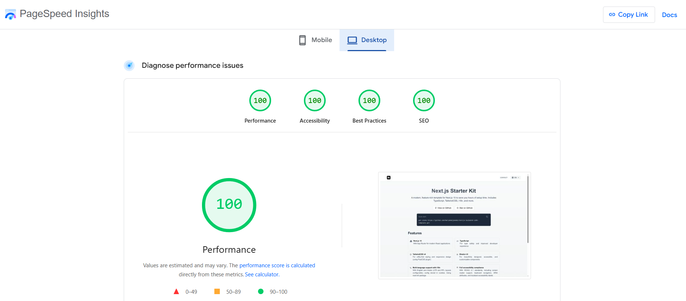

# Next.js Landing Page Starter Kit

A modern, feature-rich starter kit for Next.js projects with TypeScript, TailwindCSS, multi-language support, and a fully functional contact form. The template can save you hours of setup time and focus on building your unique landing page or application. The template has 100% lighthouse metrics performance.



## 📑 Table of Contents

- [Features](#-features)
- [What's Included](#-whats-included)
- [Getting Started](#️-getting-started)
  - [Prerequisites](#prerequisites)
  - [Installation](#installation)
  - [Running the Development Server](#running-the-development-server)
- [Project Structure](#-project-structure)
- [Customization](#-customization)
  - [Styling](#styling)
  - [Adding New Pages](#adding-new-pages)
  - [Translations and Language Support](#translations-and-language-support)
- [Theme Configuration Guide](#-theme-configuration-guide)
  - [Adding New Theme Colors](#adding-new-theme-colors)
  - [Adding Non-Color Theme Values](#adding-non-color-theme-values)
- [Environment Variables](#-environment-variables)
- [Email Integration](#-email-integration)
- [Google Analytics](#-google-analytics)
- [Deployment](#-deployment)
- [License](#-license)

## 🚀 Features

- **Next.js 15** with App Router for modern React applications
- **TypeScript** for type safety and improved developer experience
- **TailwindCSS v4** for utility-first styling and responsive design
- **Multi-language support** with English and Arabic (LTR and RTL layouts) with `next-intl`
- **Contact form** with Zod validation and Resend email integration
- **Popup Toasts/Notifications** using Sonner for user feedback
- **Google Analytics** integration for tracking user behavior
- **Responsive design** that works on all devices
- **ESLint** and **Prettier** for code quality and consistency

## 📋 What's Included

- **Clean Landing Page**: Simple, modern design that's easy to customize
- **Contact Form**: Ready-to-use form with validation and email integration
- **Language Switcher**: Toggle between English and Arabic with automatic RTL support
- **SEO Ready**: Optimized metadata structure for better search engine visibility
- **Performance Optimized**: Fast loading times and optimized assets

## 🛠️ Getting Started

### Prerequisites

- Node.js (version 18.x or later recommended)
- pnpm

### Installation

1. Clone the repository:

   ```bash
   git clone https://github.com/maryamaljanabi/nextjs-tailwind-i18n-template my-project
   ```

2. Navigate to the project directory:

   ```bash
   cd my-project
   ```

3. Install dependencies:

   ```bash
   pnpm install
   ```

4. Set up environment variables:
   ```bash
   cp .env.example .env
   ```
   Then edit `.env` to add your Resend API key and Google Analytics ID.

### Running the Development Server

To start the development server, run:

```bash
pnpm dev
```

Open [http://localhost:3000](http://localhost:3000) with your browser to see the result.

## 📁 Project Structure

```
├── public/                     # Static assets
├── src/
│   ├── app/                    # Next.js app directory (routes, pages)
│   │   ├── api/                # API routes (send-email)
│   │   ├── contact/            # Contact page
│   │   ├── globals.css         # Global CSS styles
│   │   ├── layout.tsx          # Root layout for the application
│   │   └── page.tsx            # Main page component
│   ├── components/             # Reusable UI components
│   │   ├── contact/            # Contact form related components
│   │   ├── layout/             # Layout components (e.g., Navbar, Footer)
│   │   ├── shared/             # Shared components (e.g., LanguageSwitcher)
│   │   └── ui/                 # Shadcn/ui components
│   ├── i18n/                   # Internationalization (next-intl) configuration and translations
│   │   ├── request.ts          # Request configuration for next-intl
│   │   ├── routing.ts          # Routing configuration for next-intl
│   │   └── translations/       # Translation files
│   │       ├── ar.json         # Arabic translations
│   │       └── en.json         # English translations
│   │   └── utils.ts            # Utility functions for i18n
│   │   └── actions.ts          # Server actions for i18n
│   ├── lib/                    # Utility functions and libraries
│   │   ├── emails/             # Email templates
│   │   ├── metadata.ts         # Metadata utilities
│   │   └── utils.ts            # General utility functions
```

## 🔧 Customization

### Styling

This template uses TailwindCSS for styling. You can customize the theme in `globals.css`.

### Adding New Pages

Create new directories in the `src/app` directory to add new pages to your application.

### Translations and Language Support

Add or modify translations in the `src/i18n/translations` directory. The template supports English (`en.json`) and Arabic (`ar.json`) by default.

To add a new language:

1. Create a new JSON file in the `src/i18n/translations` directory (e.g., `fr.json`)
2. Update the `language-context.tsx` file to include the new language.
3. Add the language to the `Language` type and constant in `src/i18n/utils.ts`. This will be reflected in the `next-intl` config specified in the `src/i18n/routing.ts`

#### RTL Support

The template decouples RTL support from specific languages, allowing you to associate RTL with any language you need. To configure RTL support:

1. In `src/i18n/utils.ts`, modify the `RTL_LANGUAGES` array to include any languages that should use RTL layout:

```typescript
// Define which languages use RTL direction
const RTL_LANGUAGES = ["ar", "fa"]; // Example: Arabic, Persian
```

2. The language context will automatically apply RTL styling when a language in this array is selected.

#### Language Switcher

The language switcher component in the navbar allows users to toggle between available languages. It features:

- A globe icon for universal recognition
- Responsive design that works on all screen sizes
- Automatic RTL/LTR switching based on the selected language

## 🎨 Theme Configuration Guide

This guide explains how to add and configure custom theme colors and values in a Tailwind CSS v4 + shadcn/ui project.

### Adding New Theme Colors

Follow these steps in order to add a new color to your theme:

#### Step 1: Define the Color Value in `:root`

In your globals.css, add the new color to the `:root` block, for example, to add a new color variable named `brand`:

```css
:root {
  /* Existing colors... */

  /* Add your new colors */
  --brand: oklch(0.6 0.2 240);
}
```

#### Step 2: Map to Tailwind in `@theme inline`

Add the corresponding mapping in the `@theme inline` block:

```css
@theme inline {
  /* Existing mappings... */

  /* Add your new color mappings */
  --color-brand: var(--brand);
}
```

#### Step 3: Use in Your Components

Now you can use your new color with Tailwind utilities:

```jsx
// Background colors
<div className="bg-brand">Brand section</div>

// Text colors
<p className="text-brand">Brand colored text</p>

// Borders
<div className="border-brand">Brand border</div>

// Hover states
<button className="bg-brand hover:bg-brand/90">Brand button</button>
```

### Adding Non-Color Theme Values

You can also add other design tokens like spacing, or border radius:

#### Custom Spacing

```css
/* Step 1: In :root */
:root {
  --spacing-section: 5rem;
  --spacing-component: 2rem;
}

/* Step 2: In @theme inline */
@theme inline {
  --spacing-section: var(--spacing-section);
  --spacing-component: var(--spacing-component);
}
```

### Adding Custom Fonts

Adding custom fonts involves a few steps to ensure they are correctly integrated and applied throughout the application:

#### Step 1: Importing Fonts in `layout.tsx` (or similar layout file):

First, import your required font in the main layout file. For example, to import 'Open Sans':

```typescript
import { Open_Sans } from 'next/font/google';

const openSans = Open_Sans({
  variable: '--font-open-sans',
  subsets: ['latin'],
  display: "swap",
});

export default function RootLayout({ children }: { children: React.ReactNode }) {
  return (
    <html lang="en" className={`${openSans.variable}`}>
      <body>{children}</body>
    </html>
  );
}
```

#### Step 2: Applying Fonts with Tailwind CSS Classes or via `globals.css`:

You can apply the font directly using Tailwind classes:

```jsx
<p className="font-(family-name:--font-open-sans)">This text uses Open Sans.</p>
```

Or, to apply it globally to the `body` tag, you can add it to `globals.css`:

```css
body {
  font-family: var(--font-open-sans);
}
```

## ⚙️ Environment Variables

This project uses environment variables to manage sensitive information and configuration. Before running the application, ensure you have set up the following variables in your `.env` file:

- `RESEND_API_KEY`: Your API key for Resend, used for sending emails via the contact form.
- `GOOGLE_ANALYTICS_ID`: Your Google Analytics Measurement ID (e.g., `G-XXXXXXXXXX`) for tracking user behavior.
- `EMAIL_FROM`: The email address from which the contact form submissions will appear to be sent (e.g., `onboarding@resend.dev`). This should be a verified sender in your Resend account.
- `EMAIL_TO`: The email address to which contact form submissions will be sent (e.g., `your-email@example.com`).

To set up your environment variables, copy the example file and then edit it with your actual values:

```bash
cp .env.example .env
```

## 📧 Email Integration

This template uses [Resend](https://resend.com) for sending emails from the contact form. To set it up:

1. Sign up for a Resend account
2. Get your API key
3. Add it to your `.env` file as `RESEND_API_KEY`
4. The resend implementation is in `src/app/api/send-email/route.ts`. The 'from' and 'to' email addresses for the contact form are configured via environment variables (`EMAIL_FROM` and `EMAIL_TO`) for flexibility and security. Ensure these are properly set in your `.env` file as described in the [Environment Variables](#-environment-variables) section.

Make sure the email used in the `from` field is from a domain you have verified with Resend. The `to` field should be the email address where you want to receive the contact form submissions.

## 🌐 Google Analytics

To enable Google Analytics:

1. Create a Google Analytics 4 property and get your Measurement ID
2. Add it to your `.env` file as `NEXT_PUBLIC_GA_ID`

## 🚀 Deployment

This project can be easily deployed on platforms like Vercel, Netlify, or any other hosting provider that supports Next.js applications. Do not forget to set your environment variables for production in any hosting service.

## 📦 Key Packages Used

- **@next/third-parties**: For integrating third-party scripts like Google Analytics
- **resend**: For sending emails from the contact form
- **sonner**: For beautiful toast notifications
- **zod**: For form validation and type safety
- **tailwind-merge & class-variance-authority**: For managing Tailwind classes
- **lucide-react**: For icons
- **prettier & eslint**: For code formatting and linting
- **next-intl**: For smooth i18n experience

## 📝 License

- MIT License
- Copyright 2025 © Maryam Aljanabi
